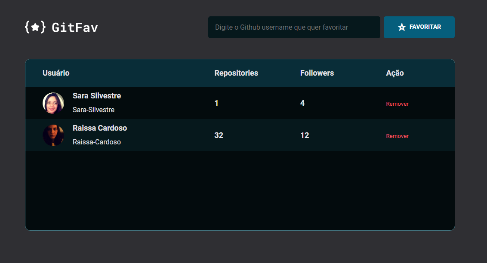

# Projeto GitFav do curso Explorer da Rocketseat

    
    
    

GitFav é uma aplicação simples que permite aos usuários pesquisar por um usuário do Github e favoritá-lo. A aplicação exibe uma lista de usuários favoritados com informações básicas como repositórios e seguidores.

## :building_construction: Funcionalidades

- Pesquisar por um usuário do Github.
- Favoritar um usuário pesquisado.
- Visualizar uma lista de usuários favoritados com informações como repositórios e seguidores.

## :exclamation: Pré-requisitos

Navegador web moderno

## :hammer: Instalação

1. Clone o repositório: git clone https://github.com/Raissa-Cardoso/XR-GitFav.git
2. Abra o arquivo `index.html` em seu navegador web.

## :computer: Uso

1. Na página inicial, insira o nome de usuário do Github no campo de pesquisa.
2. Clique no botão "Favoritar" para adicionar o usuário à lista de favoritos.
3. A tabela abaixo será atualizada com o usuário favoritado e suas informações.

## :star: Tecnologias utilizadas

- **`HTML`**
- **`CSS`**
- **`Javascript`**
